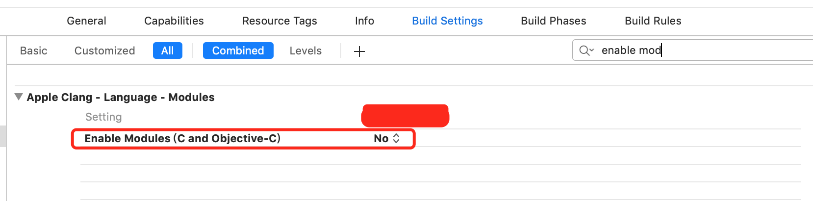

## CCache提高Xcode的编译速度

在iOS日常开发中，随着业务的不断增加，项目变大，编译的速度越来越慢。有时调个UI，可能就改了一行代码，结果编译了很长时间，严重影响了我们日常的开发效率。下面我将介绍一下，CCache这个工具来帮助我们提高项目的编译速度。

#### 1、CCache介绍

CCache 是一个能够把编译的中间产物缓存起来的工具，它会在实际编译之前先检查缓存。

#### 2、CCache安装

CCache安装比较简单，通过homebrew安装即可。

```
brew install ccache
```

#### 3、配置CCache

- 创建ccache编译脚本

为了能让 CCache 介入到整个编译的过程，我们要把 CCache 作为项目的 C 编译器，当 CCache 找不到编译缓存时，它会再把编译指令传递给真正的编译器 clang。

新建一个文件命名为 ccache-clang，内容如下：

```
#!/bin/sh
if type -p ccache >/dev/null 2>&1; then
  export CCACHE_MAXSIZE=10G
  export CCACHE_CPP2=true
  export CCACHE_HARDLINK=true
  export CCACHE_SLOPPINESS=file_macro,time_macros,include_file_mtime,include_file_ctime,file_stat_matches

  # 指定日志文件路径到桌面，等下排查集成问题有用，集成成功后删除，否则很占磁盘空间
  export CCACHE_LOGFILE='~/Desktop/CCache.log'
  exec ccache /usr/bin/clang "$@"
else
  exec clang "$@"
fi
```

然后使ccache-clang文件有可执行的权限。

```
chmod 777 ccache-clang
```
如果你的项目中或者三方库中需要支持 C++ ，需要创建ccache-clang++文件，并增加可执行权限，内容如下：

```
#!/bin/sh
if type -p ccache >/dev/null 2>&1; then
  export CCACHE_MAXSIZE=10G
  export CCACHE_CPP2=true
  export CCACHE_HARDLINK=true
  export CCACHE_SLOPPINESS=file_macro,time_macros,include_file_mtime,include_file_ctime,file_stat_matches

  # 指定日志文件路径到桌面，等下排查集成问题有用，集成成功后删除，否则很占磁盘空间
  export CCACHE_LOGFILE='~/Desktop/CCache.log'
  exec ccache /usr/bin/clang++ "$@"
else
  exec clang++ "$@"
fi
```

- 配置Xcode

将ccache-clang文件(或者ccache-clang++)拷贝到自己项目的工程目录(.xcodeproj同级)下。

1、配置CC常量

在你项目的构建设置(Build Settings)中，添加一个常量CC，这个值会让 Xcode 在编译时把执行路径的可执行文件当做 C 编译器。CC常量的值是：`$(SRCROOT)/ccache-clang` 如果ccache-clang文件在其他目录，改成相应的目录。


2、关闭Clang Modules

因为 CCache 不支持 Clang Modules，所以需要把 Enable Modules 的选项关掉。


然后搜索项目中类似，`@import UIKit` 修改成 `#import <UIKit/UIKit.h>`，这样系统中的一些库，Xcode就不会自动帮我们引入，需要我们通过 Build Phrase -> Link Binary With Libraries 手动添加。

> 建议：移除项目中PCH文件。PCH 的内容会被附加在每个文件前面，而 CCache 是根据文件内容的 MD4 摘要来查找缓存的，因此当你修改了 PCH 或者 PCH 引用到的头文件的内容时，会造成全部缓存失效，只能全体重新编译。因此如果 PCH 或者 PCH 引入的文件被频繁修改的话，缓存就会频繁地 miss，这种情况下还不如不用 CCache。

3、如果项目使用了CocoaPods来做包管理，需要针对Pods工程做类似的配置(上面说的配置CC和关闭Clang Modules)。但是因为 CocoaPods 每次执行 pod update 的时候都会把 Pods 项目重新生成一遍，如果直接在 Xcode 里面修改 Pods 项目里面的 Enable Modules 选项，下次执行pod update的时候又会被改回来。我们需要在 Podfile 里面加入下面的代码，让生成的项目关闭 Enable Modules 选项，同时加入 CC 参数，否则 pod 在编译的时候就无法使用 CCache 加速：

```
post_install do |installer_representation|
  installer_representation.pods_project.targets.each do |target|
    target.build_configurations.each do |config|
      #关闭 Enable Modules
      config.build_settings['CLANG_ENABLE_MODULES'] = 'NO'

      # 在生成的 Pods 项目文件中加入 CC 参数，路径的值根据你自己的项目来修改
      config.build_settings['CC'] = '$(PODS_ROOT)/../ccache-clang' 
    end
  end
end
```

#### 4、验证CCache是否生效

上面的都配置完成后，先清理一下工程 快捷键`command + shift + k`，然后编译。编译完成后，修改一下项目内容再次编译，然后在终端执行 `ccache -s` 结果如下：


刚开始缓存的命中率可能没有这么高，多执行几次后命中率较高。到此CCache就配置完成了，enjoy it!

我在之前的混编项目中试验了下，正常全新编译时间大约1min20s，使用了CCache后，全新编译之间只需20s，编译速度提升还是比较明显的。

#### 5、Swift 是否支持问题
CCache是支持Swift项目及Swift混编项目的，但是如果Swift中引用了OC三方库，并且这个三方库通过Pods管理生成framework，那么CCache不能使用了。由于Swift对应的OC代码生成文件 `项目名-Swift.h` 中使用了 `@import Modules`。

> 参考：
[贝聊科技 如何将 iOS 项目的编译速度提高5倍](https://juejin.im/post/59539377f265da6c415f064d)