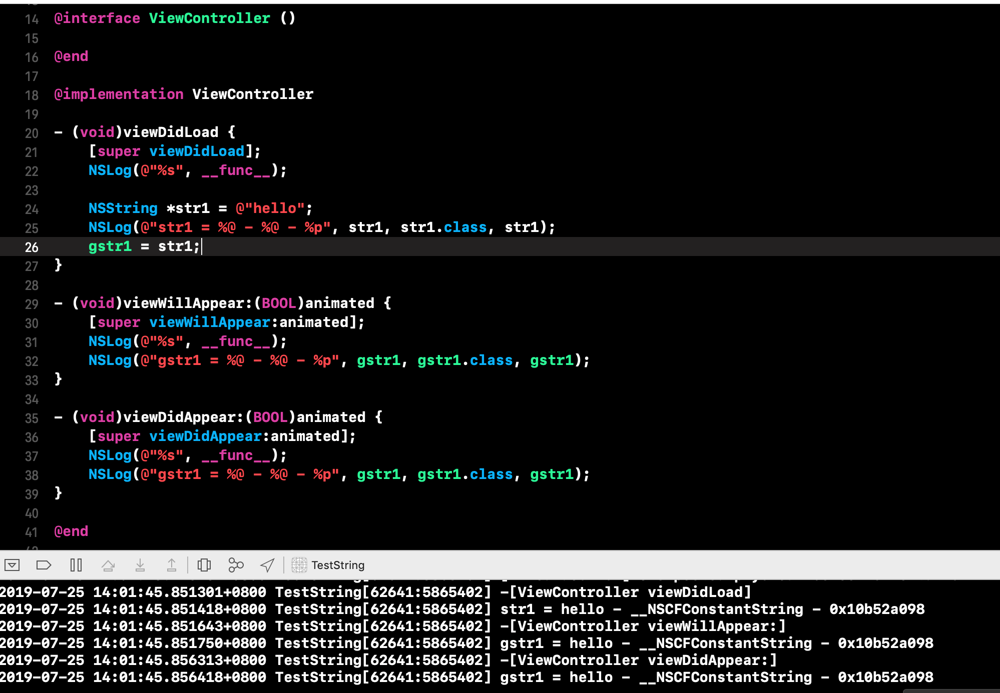

## iOS中NSString内存管理

引言：NSString作为iOS日常开发中常用的类型，我们有必要清楚它的内存表示以及内存管理。那一个方法中定义的NSString对象是何时释放的呢？自定义的对象呢？下面我将通过demo来回答这几个问题。

下面的Demo将借助UIViewController的生命周期方法viewDidLoad, viewWillAppear, viewDidAppear 方法进行。我们知道weak修饰的对象不影响其指向对象的生命周期，此处定义全局的weak对象来观察局部对象的变化过程。

#### 1、方法中局部自定义对象的释放时机

从上图可以看出，自定义对象Person在出了viewDidLoad的作用域后便释放了。NSString是否也是出了作用域就释放了呢？

#### 2、NSString的释放时机

- 字面量字符串

从上图可以看到，gstr1出了作用域后一直没有释放。详细分析发现，demo中的 `str1` 的 `isa` 是__NSCFConstantString，也就是常量字符串。我们知道常量字符串，是在常量区，程序运行期间一直存在不会被释放。那么此处没有别释放是合理的。

- 非常量字符串

从上图结果看到，gstr2出了作用域也一直没有被释放。此处 `str2` 的 `isa` 是NSTaggedPointerString。

> NSTaggedPointerString是 [TaggedPointer](https://www.jianshu.com/p/3176e30c040b) 的一种, 是系统用来存储较小对象，比如NSNumber，NSString，NSDate。它是一种特殊的指针，指针一部分代表存储的值，一部分来标记是TaggedPointer，本身不指向任何地址。

到此可以明白gstr2没有释放的原因是由于系统将其作为TaggedPointer存储，并没有指向内存地址。

是不是所有的NSString都是存储为TaggedPointer？很显然不是的，当NSString标识大量字符串时，NSString便存储在堆上了。那么一般多少个字符系统会用NSTaggedPointerString表示呢？

上图可以看到，`str3` 的 `isa` 是__NSCFString。并且 gstr3 在 viewDidLoad 结束时并没有释放，在 viewWillAppear 时仍然有值，直到 viewDidAppear 时才释放。这是什么原因呢？此处我也没有更好的办法来直接验证，不过通过运行调试Runtime源码可以发现，在当前autoreleaspool释放时，isa 为 __NSCFString 释放了。

经测试发现，一般NSString表示小于10个 ASSII字符时，系统会用NSTaggedPointerString表示字符串。

- NSString 不同初始化方法的差异

从上面结果可以看出，stringWithString，initWithString创建的字符串并没有开辟新的地址空间，而是将指向了原字符串的地址，stringWithFormat，initWithFormat，当小于10 时都是NSTaggedPointerString，大于等于10的字符串的 isa 时__NSCFString开辟了新的空间。

#### 3、总结

1、iOS有3中表现形式，`__NSCFConstantString`，NSTaggedPointerString，`__NSCFString`

2、一般字面量字符串是 `__NSCFConstantString`；通过WithFormat生成，并且字符个数小于10个时，NSTaggedPointerString，字符个数大于等于10个时是 `__NSCFString`。

3、`isa` 是 `__NSCFString` 离开作用域时并不会立即释放，而是在autoreleasepool释放时释放

> [demo地址](./TestString)

